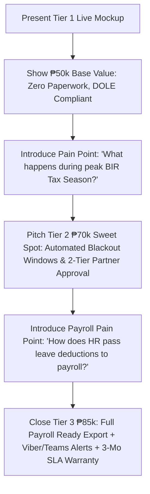

# Project Proposal & Pricing Tiers: Leave Management System (LMS)
**Client:** JTYeo CPA Accounting Office  
**Prepared For:** Executive Presentation & Proposal  
**Currency:** Philippine Peso (PHP / ₱)

---

## Executive Summary
For an accounting and auditing firm in the Philippines, workforce scheduling, billable hour tracking, and DOLE-compliant leave governance are critical to maintaining client deliverables during peak tax and audit seasons. 

This proposal outlines three strategic implementation tiers:
- **Tier 1 (₱50,000) — Core DOLE-Ready Leave Management System (Basic Base)**
- **Tier 2 (₱65,000) — Professional CPA Practice Suite (Current Upgraded Live System)** ⭐
- **Tier 3 (₱85,000) — Enterprise Firm Edition (Direct Payroll Sync & Multi-Branch Auditing)**

---

## Detailed Tier Comparison Matrix

| Feature / Capability | Tier 1: Core (₱50,000) | Tier 2: Pro Suite (₱65,000) ⭐ | Tier 3: Enterprise Suite (₱85,000) 🏆 |
| :--- | :---: | :---: | :---: |
| **Core Leave Tracking & Balances** | Included | Included | Included |
| **Philippine Statutory & CPA Practice Leaves** *(SIL, VL, SL, Bereavement, Emergency, CPA Study, Solo Parent, Maternity/Paternity, Magna Carta, VAWC, LWOP)* | Included | Included | Included |
| **Role-Based Access** *(Staff Accountant, Senior Lead, Partner/HR)* | Standard (2 Levels) | Multi-Level Hierarchical (3 Levels) | Multi-Level + Partner Override & Multi-Department |
| **Philippine Holiday Calendar Integration** | Standard list | Dynamic Sync + Special Working/Non-Working rules | Dynamic Sync + Custom Firm Year-End Closure Periods |
| **Leave Approval Engine** | Single-step | 2-Step Approval (Senior Lead Endorsement -> Partner Final Signoff) | Multi-stage dynamic routing with matrix approval |
| **Tax Season "Leave Freeze" Management** | Manual | Automated Peak-Season (March 15 - April 15) Blackout Warnings | Smart Quota Controls with partner exemption tokens |
| **Document / Medical Certificate Attachment** | Basic | In-App Preview & Verification Workflow | Cloud storage + Medical certificate verification workflow |
| **Department Engagement Coverage & Overlap Checker** | — | Included (Prevents team understaffing during client audits) | Included + Automated Resource Reallocation |
| **Annual SIL Cash Monetization Calculator** | — | Included (Real-Time Year-End Cash Liability Ledger) | Included + Taxable/Non-taxable monetization ledger |
| **Payroll & Timesheet Ready Exports** | Basic CSV export | Formatted CSV with Philippine Payroll Coding | Direct API/CSV integration ready for Sprout, QuickBooks, or custom ERP |
| **Audit Trail & System Logs** | Standard timestamps | Detailed user activity logs (Who approved/modified and when) | Immutable BIR-ready audit logs with IP logging & report stamping |
| **Deployment, Hosting Setup & Training** | XAMPP/Cloud deploy + 1 session | Cloud setup + 2 training sessions + User manual PDF | Turnkey deployment + 3 training sessions + 3 months priority SLA |

---

## Tier Breakdown & Sales Pitch Guide

### 🥉 Tier 1: Essential Leave Portal — ₱50,000
*Target: Getting the firm organized, eliminating paper leave forms and spreadsheets.*

---

### 🥈 Tier 2: Professional Accounting Practice Suite — ₱65,000 (Recommended Package)
*Target: Tailored for CPA practices with peak tax filing deadlines, dual audit signoffs, and cash conversion tracking.*

#### What is Included in the ₱65,000 Live Build:
1. **Two-Stage Approval Workflow**: Senior Audit Lead endorses staff availability first, followed by Managing Partner final confirmation.
2. **Tax & Audit Season Blackout Warning**: Automated alerts when filing during March 15 – April 15 peak BIR tax filing windows.
3. **Medical Certificate & Document Uploader**: In-app document preview for medical doctor slips, CPD seminar notices, and death certificates.
4. **Engagement Team Overlap Checker**: Real-time team conflict detection to ensure client engagements always have adequate audit staff.
5. **Annual SIL Cash Monetization Ledger**: Live computation of accrued SIL cash conversions for year-end financial reserve planning.
6. **Payroll Leave Deduction CSV**: Clean export mapped for standard Philippine payroll deductions.
7. **Comprehensive Audit Trail**: Timestamped and IP-logged records of every application, approval, and balance adjustment.

---

### 🥇 Tier 3: Enterprise Accounting Suite & Payroll Sync — ₱85,000 (Maximum Value)
*Target: Full-scale digital transformation with payroll readiness, chat alerts, and premium executive governance.*

#### Why Upgrade from Tier 2 (+₱15,000 incremental value):
1. **Payroll Export Engine**: One-click payroll export mapped to client's payroll software or Excel format (computes unpaid leaves, deductions, and taxable vs non-taxable conversions).
2. **Multi-Department / Engagement Team Matrix**: Group staff by Audit, Tax, Advisory, Bookkeeping, and Admin with department-specific leave caps (so no engagement team is left understaffed).
3. **Chatbot / Messaging Alerts (Viber / MS Teams / Slack)**: Instant ping to managers when emergency sick leave is submitted in the morning.
4. **Partner Analytics & Executive BI Dashboard**:
   - Monthly absentee heatmaps.
   - Utilization rate during audit seasons.
   - Departmental leave liability forecasting (monetary cost of unconsumed leaves).
5. **Priority Warranty & SLA Support**: 3 months complimentary bug fixes, priority feature tweaks, video staff training library, and on-demand partner support.
6. **Delivery Timeline**: 4–5 weeks.

---

## Strategy for Saturday's Pitch

### Closing Pitch Script for the Meeting:
> *"We have already built the core Tier 1 engine (₱50k) that eliminates paper forms and manages DOLE statutory leaves. However, because you are an accounting firm handling critical audit and tax deadlines, we strongly recommend **Tier 2 (₱70k Sweet Spot)** or **Tier 3 (₱85k Enterprise)**. For just an additional ₱20k–₱35k, you get peak-season leave lockdown controls, automated 2-tier partner signoffs via email, instant Viber morning absence alerts, and direct payroll-ready leave deduction exports with 3 months full SLA warranty."*
