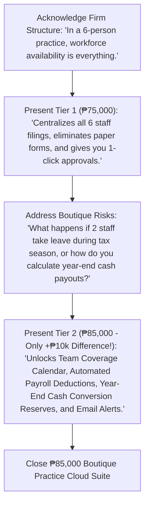

# Software Development Proposal & Pricing Packages
**Client:** JTYeo CPA Accounting Office  
**Prepared For:** Atty. Jonathan Yeo, CPA (Managing Partner)  
**Practice Profile:** Boutique CPA & Tax Practice (6 Personnel: 1 Managing Partner + 5 Professional Associates)  
**Currency:** Philippine Peso (PHP / ₱)

---

## Executive Summary & Firm Context
In a boutique accounting practice of **6 professionals**, workforce coordination is critical. If even one or two staff members are away concurrently during peak audit engagements or tax filing cut-offs, **up to 33%–50% of the firm's operational capacity is impacted**.

Manual tracking via paper forms or spreadsheets leads to engagement bottlenecks, missed client deadlines, uncoordinated overlapping absences, and unexpected year-end cash conversion liabilities.

This proposal outlines **two tailored implementation packages** custom-engineered for **JTYeo CPA Accounting Office**:
- **Tier 1: Boutique Practice Edition (₱75,000)** — Dedicated 6-user digital leave tracking and Managing Partner approval portal.
- **Tier 2: Boutique Practice Cloud Suite (₱85,000) 🏆** — Full automation with 1-click payroll deduction export, owner year-end cash payout liability forecasting, team coverage calendar, and tax deadline protection.

---

## 📊 Deliverables & Features Comparison Matrix

| System Module & Capability | Tier 1: Boutique Edition (₱75,000) | Tier 2: Boutique Suite (₱85,000) 🏆 *(Recommended)* |
| :--- | :--- | :--- |
| **Target Practice Size** | Tailored for 6 Practice Personnel | Tailored for 6 Practice Personnel + Expandable |
| **Leave Policy Coverage** | 5 Core Firm Categories (VL, SL, Emergency, Bereavement, LWOP) | Full 12 Statutory & Firm Categories (Solo Parent, Maternity, Paternity, Special Women, VAWC, CPD Study, etc.) |
| **Semi-Monthly Payroll Sync** | Manual Entry from Ledger Table | 1-Click Formatted Payroll CSV Export (JuanTax, Sprout Solutions, QuickBooks, Excel) with Auto-Deductions |
| **Owner Year-End Cash Liabilities** | Manual Computation per Staff | Automated Real-Time Leave Cash Conversion Ledger (Live Year-End Cash Payout Liability Forecast for 5 Staff) |
| **Firm Coverage & Scheduling** | Standard History List | Interactive 6-Person Team Absence Calendar (Visual Coverage Tracker to Prevent Overlapping Absences) |
| **Medical Proof Verification** | Physical Paper Note Submission | In-App Medical Certificate & Document Proof Uploader with 1-Click Secure In-App Viewer |
| **Compliance & Audit Records** | Standard Application Database Logs | Immutable Enterprise Audit Trail with IP Tracking, Timestamps, and Action Histories |
| **Real-Time Staff Alerts** | In-App Dashboard Notifications | Automated Real-Time Transactional Email Alerts (Filing, Approvals, Rejections) |
| **Working Days Calculation** | Consecutive Calendar Days Math | Automated Working Days Engine (Auto-Excludes Weekends & Official Regular/Special Holidays) |
| **Tax Season Blackout Advisory** | Manual Owner Oversight | Peak Tax Season Blackout Advisory Engine (Engagement Clearance Alerts for March 15 – April 15) |
| **Credit Accrual & Rollover** | Manual Yearly Balance Reset | Automated Monthly Accruals (+1.25d/mo) & Annual Fiscal Year Rollover Engine |
| **Managing Partner Governance** | Approval Queue & On-Behalf Filing | Executive Approval Portal, Engagement Notes, Proxy Filing & Roster Availability Overview |
| **Production Server Setup** | Full Server Setup, Database Config & SSL | Full Server Setup, Database Config, SSL & Scheduled Auto-Backups |
| **Warranty & SLA Support** | 60 Days Standard Maintenance Support | 3 Months Priority SLA Support + Live Staff Onboarding & Training Session |

---

## 🥈 Tier 1: Boutique Practice Edition — ₱75,000
> **Package Scope:** A streamlined, custom-built web application deployed on firm infrastructure to replace paper forms and centralize leave tracking for all 6 firm members.

### 📦 Key Deliverables:
1. **6-User Role-Based Access Control (RBAC):**
   - Individual login credentials for the Managing Partner and all 5 staff associates.
2. **Real-Time Leave Balance Ledger:**
   - Accurate tracking of Vacation Leave (12.0d), Sick Leave (10.0d), Emergency Leave, Bereavement Leave, and Leave Without Pay.
   - Live balance deduction upon Managing Partner approval.
3. **Managing Partner Approval Governance:**
   - Centralized approval queue for Atty. Jonathan Yeo to review, approve, or reject requests with customized feedback/engagement notes.
4. **Partner Proxy Filing:**
   - Capability for the Managing Partner to file leave on behalf of any associate with instant balance checks.
5. **Staff Self-Service Portal:**
   - Dedicated dashboard for associates to check remaining credits, submit requests, and track approval status.
6. **Master Firm Leave Ledger:**
   - Complete historical log of all filings with status filters (*Approved, Pending, Rejected*).
7. **Server Setup & Deployment:**
   - Complete deployment, database configuration, and SSL security on firm servers.
8. **Warranty & Technical Support:**
   - 60 Days standard bug-fix warranty and technical maintenance.

---

## 🥇 Tier 2: Boutique Practice Cloud Suite — ₱85,000 ⭐ *(Recommended Flagship)*
> **Package Scope:** The complete automated practice management suite designed to protect firm productivity, automate payroll math, eliminate audit bottlenecks, and forecast owner cash payout obligations.

### 📦 Key Deliverables (Everything in Tier 1 PLUS):
1. **📊 1-Click Formatted Payroll CSV Export Engine:**
   - Generates payroll deduction summaries custom-formatted for Philippine payroll software (**JuanTax**, **Sprout Solutions**, **QuickBooks**, or Excel). Automatically computes unpaid leave salary deductions per semi-monthly cutoff.
2. **💰 Year-End Unused Leave Cash Conversion Ledger & Reserve Calculator:**
   - Real-time automated calculator that multiplies unconsumed leave balances by each employee's daily rate, providing Atty. Yeo with an instant forecast of annual cash conversion payouts required at year-end.
3. **📅 Interactive 6-Person Team Coverage Calendar:**
   - Visual monthly schedule showing team availability. Ensures that multiple associates on the same client engagement do not take simultaneous leaves during critical audit deadlines.
4. **📎 Digital Medical Certificate & Supporting Proof Engine:**
   - Staff can upload physician notes, medical slips, and seminar proof directly in the portal, allowing the Managing Partner to verify legitimacy in 1 click.
5. **🛡️ Immutable Enterprise Audit Trail with IP Tracking:**
   - Tamper-proof activity logs capturing every submission, approval, rejection, and balance change with exact timestamps, staff names, and client IP addresses.
6. **📧 Automated Real-Time Email Notifications:**
   - Instant transactional email alerts sent to associates and Atty. Yeo whenever leaves are submitted, approved, or decided.
7. **🌴 Automated Holiday & Working Days Exclusion Calculator:**
   - Automatically detects and excludes weekends and official statutory regular/special non-working holidays from leave deductions.
8. **⚠️ Peak Tax Season Blackout Advisory Engine:**
   - Visual alert banner and clearance reminder for leaves requested during annual income tax return filing cut-offs (March 15 – April 15).
9. **⚙️ Automated Monthly Accrual & Annual Fiscal Rollover Engine:**
   - Configurable monthly accrual rules (+1.25d VL monthly) and automated year-end credit resets and rollovers.
10. **📜 Extended Statutory Category Pack:**
    - Full configuration of Solo Parent Leave, Maternity Leave, Paternity Leave, Special Women Leave, VAWC Leave, and CPA Board Exam/CPD Study Leave.
11. **🤝 3 Months Priority SLA Support & Full Staff Onboarding:**
    - **3 Months Extended Priority SLA Support**, video walkthroughs, and a live onboarding training session for all 6 firm members.

---

## 🎯 Executive Pitch Script Tailored for Atty. Jonathan Yeo

> *"Atty. Yeo, in a boutique practice of 6 professionals, workforce coordination is everything — if two associates take leave simultaneously during audit season, half your operational capacity is gone.*
> 
> *Our **Boutique Practice Edition (₱75,000)** provides a dedicated system to replace paper forms, track all 5 staff balances, and give you 1-click approvals.*
> 
> *However, for just an additional **₱10,000 (₱85,000 Cloud Suite)**, you unlock the **Team Coverage Calendar** (preventing overlapping absences), **1-Click Payroll CSV Export** (saving you hours on payroll math), **Year-End Cash Conversion Ledger** (forecasting your exact annual cash payout liability), **Medical Proof Verification**, **Email Alerts**, and **3 Months Priority Support** with full staff onboarding."*
