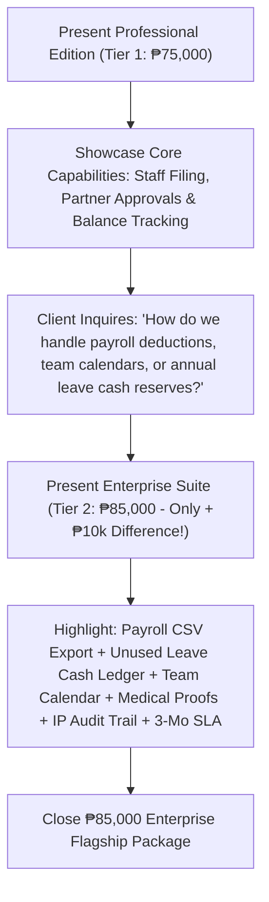

# Project Proposal & Pricing Tiers: Leave Management System (LMS)
**Client:** JTYeo CPA Accounting Office  
**Prepared For:** Atty. Jonathan Yeo, CPA & Management Committee  
**Currency:** Philippine Peso (PHP / ₱)

---

## Executive Summary
For an established accounting and auditing practice, workforce availability, leave management, and engagement governance are vital to maintaining client service quality and meeting critical firm deadlines.

This proposal establishes **two clear commercial implementation tiers**:
1. **Tier 1 (₱75,000) — Professional Edition** *(Core Firm Leave Management)*
2. **Tier 2 (₱85,000) — ⭐ Enterprise Suite** *(Complete End-to-End Automation — Recommended)*

---

## 2-Tier Comparison Matrix

| Feature & Capability | Tier 1: Professional Edition (₱75,000) | Tier 2: Enterprise Suite (₱85,000) 🏆 |
| :--- | :---: | :---: |
| **Employee Self-Service Portal & Personal Balance Tracking** | Included | Included |
| **5 Core Essential Leave Categories (VL, SL, Emergency, Bereavement, LWOP)** | Included | Included |
| **Managing Partner & HR Executive Governance Dashboard** | Included | Included |
| **Managing Partner Review Queue (Approve / Reject with Notes)** | Included | Included |
| **Managing Partner Filing On Behalf of Any Employee** | Included | Included |
| **Leave Application Details & Review Status Breakdown** | Included | Included |
| **Personal Leave History & Status Indicators** | Included | Included |
| **High-Performance Offline System Architecture** | Included | Included |
| **Automated Formatted Payroll CSV Export (JuanTax / Sprout / QuickBooks)** | — | **INCLUDED (One-Click Deduction Sync)** |
| **Year-End Unused Leave Cash Conversion Ledger & Reserve Calculator** | — | **INCLUDED (Financial Liability Forecast)** |
| **Interactive Multi-Department Absence Calendar & Schedule Sync** | — | **INCLUDED (Visual Multi-Staff Availability)** |
| **Medical Certificate & Supporting Document Proof Viewer** | — | **INCLUDED (In-App Verification Engine)** |
| **Immutable Enterprise Audit Activity Trail with IP Tracking** | — | **INCLUDED (Tamper-Proof Compliance Logs)** |
| **Automated Real-Time Email Notifications & Manager Alerts** | — | **INCLUDED (Instant Transactional Emails)** |
| **Automated Holiday & Working Days Exclusion Calculator** | — | **INCLUDED (Auto-Excludes Weekends & Holidays)** |
| **Peak Tax Season Blackout Advisory Engine** | — | **INCLUDED (Engagement Clearance Warnings)** |
| **Administrative Accrual Engine (+1.25d/mo & Annual Rollover)** | — | **INCLUDED (Automated Credit Refreshes)** |
| **Extended Statutory Category Pack (Solo Parent, Maternity, Paternity, etc.)** | — | **INCLUDED (Full Category Suite)** |
| **Warranty & SLA Support Period** | 60 Days Standard | **3 Months Priority SLA + Staff Training** |

---

## Detailed Tier Breakdown & Feature Specifications

### 🥈 Tier 1: Professional Edition — ₱75,000
> **Target:** Centralizing all leave filings, eliminating manual paperwork, and providing clear Managing Partner approval governance.

**Everything Included in Tier 1:**
1. **Employee Self-Service Portal:**
   - Real-time personal balance summary cards: **Vacation Leave (12.0d)**, **Sick Leave (10.0d)**, and **Total Active Balance (22.0d)**.
   - Self-service leave application filing form with dynamic balance checks.
   - Personal leave history ledger with live status indicators (*Approved, Pending, Rejected*).
2. **5 Core Essential Leave Categories:**
   - 🌴 Vacation Leave (VL)
   - 🏥 Sick Leave (SL)
   - 🚨 Emergency Leave
   - 🕊️ Bereavement Leave
   - 💼 Leave Without Pay (LWOP)
3. **Managing Partner & HR Executive Dashboard:**
   - Real-time firm KPIs: Active Leaves Today, Pending Decisions Queue, Approved Applications, and Total Active Headcount.
   - Master Firm Leave Ledger with full visibility across all associate requests.
4. **1-Click Review & Decision Queue:**
   - Direct Approve and Reject actions with customized feedback and engagement coverage notes.
5. **Managing Partner Filing On Behalf of Staff:**
   - Managing Partner can submit leave for any associate with automatic balance preview lookups.
6. **Clean Leave Application Details Modal:**
   - Comprehensive breakdown of employee, category, dates, duration, reason notes, and Partner review status.
7. **High-Performance Architecture:**
   - Zero external CDN dependencies for instant rendering, offline resilience, and enterprise security.
8. **Warranty & Technical Support:**
   - 60 Days standard bug-fix warranty and technical maintenance.

---

### 🥇 Tier 2: Enterprise Suite — ₱85,000 ⭐ (Recommended Flagship)
> **Target:** Complete digital automation connecting leave records directly to firm payroll, financial liability reserves, compliance audit trails, and team calendars.

**Everything in Tier 1 (₱75,000) PLUS all of the following enterprise modules:**
1. **📊 Automated Formatted Payroll CSV Export Engine:**
   - One-click export generating deduction summaries formatted for Philippine payroll software (**JuanTax**, **Sprout Solutions**, **QuickBooks**, or Excel). Automatically computes unpaid leave deductions per pay period.
2. **💰 Year-End Unused Leave Cash Conversion Ledger & Reserve Calculator:**
   - Real-time automated computation multiplying unconsumed leave credits by employee daily wage rates, providing Managing Partners with an instant calculation of annual cash obligations.
3. **📅 Interactive Multi-Department Absence Calendar:**
   - Visual monthly schedule showing team availability and planned absences across taxation, audit, and advisory groups to prevent understaffing during client engagements.
4. **📎 Medical Certificate & Supporting Document Proof Viewer:**
   - Staff can upload physician notes, medical slips, and certificates with 1-click in-app viewing for Partner verification.
5. **🛡️ Immutable Enterprise Audit Activity Trail & IP Security Tracking:**
   - Tamper-proof logs capturing every application, approval, rejection, and balance adjustment with exact timestamps, user names, and client IP addresses.
6. **📧 Automated Real-Time Email Notifications:**
   - Instant transactional email alerts sent to staff and partners whenever leave applications are filed, approved, or rejected.
7. **🌴 Automated Holiday & Working Days Exclusion Calculator:**
   - Automatically detects and excludes weekends and official statutory regular/special non-working holidays from leave deductions.
8. **⚠️ Peak Tax Season Blackout Advisory Engine:**
   - Visual blackout warning banner and partner clearance enforcement for leaves during peak annual tax and audit deadlines.
9. **⚙️ Administrative Accrual Engine:**
   - Automated monthly accrual rules (+1.25d VL monthly) and annual rollover configuration.
10. **📜 Extended Statutory Category Pack:**
    - Full configuration of Solo Parent Leave, Maternity Leave, Paternity Leave, Special Women Leave, VAWC Leave, and CPA Board Exam/CPD Study Leave.
11. **🤝 Priority Warranty & SLA Support:**
    - **3 Months Priority SLA Support**, video walkthroughs, and a live executive onboarding training session for all practice staff.

---

## 🎯 Executive Presentation Pitch

> *"Atty. Yeo, our **Professional Edition (₱75,000)** provides everything needed to centralize firm leave filing, track personal balances, and streamline partner approvals.*
> 
> *However, for just an additional **₱10,000 (₱85,000 Enterprise Suite)**, your firm unlocks **One-Click Formatted Payroll CSV Export**, the **Year-End Unused Leave Cash Conversion Ledger** (calculating annual cash liabilities), **Interactive Team Calendars**, **Medical Certificate Proof Viewer**, **Immutable Audit Logs with IP tracking**, **Email Notifications**, and **3 Months Priority SLA Warranty** with complete staff training."*
