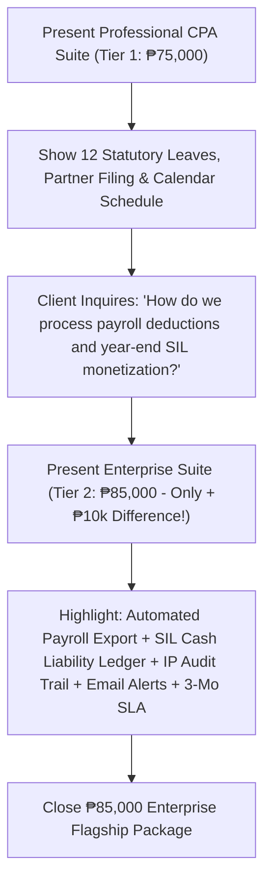

# Project Proposal & Pricing Tiers: Leave Management System (LMS)
**Client:** JTYeo CPA Accounting Office  
**Prepared For:** Atty. Jonathan Yeo, CPA & Management Committee  
**Currency:** Philippine Peso (PHP / ₱)

---

## Executive Summary
For a premier accounting and auditing practice in the Philippines, workforce scheduling, billable hour preservation, and DOLE-compliant leave governance are critical to protecting client deliverables during peak tax and audit deadlines.

This proposal outlines two streamlined implementation tiers tailored for **JTYeo CPA Accounting Office**:
- **Tier 1 (₱75,000) — Professional CPA Practice Edition (Core + Engagement Suite)**
- **Tier 2 (₱85,000) — ⭐ Enterprise Practice Cloud Suite (Target Recommendation & Payroll Integration)**

---

## 2-Tier Comparison Matrix

| Feature / Capability | Tier 1: Pro Edition (₱75,000) | Tier 2: Enterprise Cloud Suite (₱85,000) 🏆 |
| :--- | :---: | :---: |
| **Core Leave Tracking & Live Balance Ledgers** | Included | Included |
| **12 Philippine Statutory & CPA Categories** *(SIL, VL, SL, Bereavement, Emergency, Study, Solo Parent, Maternity/Paternity, Magna Carta, VAWC, LWOP)* | Included | Included |
| **Role-Based Portals** *(Staff CPA Associate & Managing Partner / HR Executive)* | Included | Included |
| **Dual Sign-Off Approval Stepper & Engagement Notes** | Included | Included |
| **Peak Tax Season (March 15 – April 15) Blackout Warnings** | Included | Included |
| **Partner Filing on Behalf of Any Employee** | Included | Included |
| **Interactive Team Absence Calendar & DOLE Holiday Engine** | Included | Included |
| **Medical Certificate & Document Proof Uploader / Viewer** | Included | Included (with Cloud Sync) |
| **Standard Formatted Leave Ledger Export** | Included | Included |
| **Year-End SIL Cash Monetization Ledger (DOLE Art. 95)** | — | **Included (Real-Time Liability Forecast)** |
| **Automated Payroll CSV Export (JuanTax / Sprout / QuickBooks)** | — | **Included (Direct Deduction Engine)** |
| **Immutable BIR-Ready Audit Trail & IP Activity Tracking** | — | **Included (Tamper-Proof Logs)** |
| **Automated Real-Time Email Notifications & Manager Alerts** | — | **Included** |
| **Administrative Accrual Engine (+1.25d/mo & SIL Rollover)** | — | **Included** |
| **Warranty & SLA Support Period** | 60 Days | **3 Months Priority SLA + Staff Training** |

---

## Detailed Tier Breakdown

### 🥈 Tier 1: Professional CPA Practice Edition — ₱75,000
* **Target:** Centralizing all leave filing, enforcing statutory DOLE rules, managing team schedules, and verifying medical slips.
* **Scope & Deliverables:**
  1. **Staff Self-Service Portal:** Instant visibility of personal leave balances (SIL, VL, SL, Solo Parent) and application history.
  2. **12 Statutory & CPA Office Categories:** Pre-configured with Philippine labor rules and CPA exam study entitlements.
  3. **Managing Partner Executive Portal:** Review queue, direct approval/rejection with notes, and ability to file leaves on behalf of any staff.
  4. **Working Days Calculator:** Automatically excludes weekends and Philippine statutory regular/special holidays.
  5. **Peak BIR Tax Season Advisory:** Visual alerts for leaves requested during March 15 – April 15 filing windows.
  6. **Interactive Team Absence Calendar:** Visual monthly schedule of approved leaves and official Philippine holidays.
  7. **Medical Certificate & Document Proof Engine:** Staff upload doctor slips / CPD notices with 1-click in-app preview.
  8. **Warranty:** 60 days standard warranty and technical support.

---

### 🥇 Tier 2: Enterprise Practice Cloud Suite — ₱85,000 ⭐ (Recommended)
* **Target:** Complete digital integration connecting leave management directly to firm financials, payroll, and executive governance.
* **Scope & Deliverables (Everything in Tier 1 PLUS):**
  1. **Year-End DOLE SIL Cash Monetization & Liability Ledger (Art. 95):** Automated real-time calculation of unconsumed SIL credits $\times$ daily salary rate, forecasting total firm cash reserve obligations.
  2. **Automated Payroll CSV Export Engine:** One-click payroll deduction summaries custom-formatted for standard Philippine payroll software (JuanTax, Sprout Solutions, QuickBooks, Excel).
  3. **Immutable Audit Activity Trail & IP Security Tracking:** Timestamped, tamper-proof logs capturing every application, approval, rejection, and balance change with client IP addresses.
  4. **Automated Real-Time Email Notifications:** Instant email alerts sent to staff and managers upon leave filing, approval, or rejection.
  5. **Automated Accrual & Rollover Engine:** Automated monthly accrual rules (+1.25d VL monthly) and annual 5.0d SIL rollover configuration.
  6. **Priority Warranty & SLA Support:** **3 Months Priority SLA Support**, bug fixes, feature adjustments, and a live staff training walkthrough session.

---

## Pitch Strategy for Saturday's Presentation

### Executive Pitch Script:
> *"Atty. Yeo, our **Professional CPA Edition (₱75,000)** provides everything needed to organize firm scheduling, manage all 12 DOLE leave categories, and verify medical certificates.*
> 
> *However, for just an additional **₱10,000 (₱85,000 Enterprise Suite)**, your firm unlocks the **Year-End SIL Cash Monetization Ledger** (computing your firm's cash liabilities under DOLE Art. 95), **One-Click Formatted Payroll CSV Export**, **Immutable BIR-Ready Audit Logs with IP tracking**, **Email Notifications**, and **3 Months Priority SLA Warranty** with complete staff training."*

