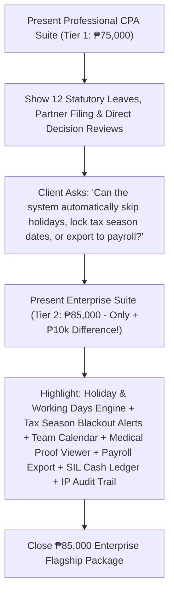

# Project Proposal & Pricing Tiers: Leave Management System (LMS)
**Client:** JTYeo CPA Accounting Office  
**Prepared For:** Atty. Jonathan Yeo, CPA & Management Committee  
**Currency:** Philippine Peso (PHP / ₱)

---

## Executive Summary
For a premier accounting and auditing practice in the Philippines, workforce scheduling, statutory compliance, and leave governance are critical to protecting client deliverables during peak tax and audit deadlines.

This proposal outlines two streamlined implementation tiers tailored for **JTYeo CPA Accounting Office**:
- **Tier 1 (₱75,000) — Professional CPA Practice Edition (The Core Live System)**
- **Tier 2 (₱85,000) — ⭐ Enterprise Practice Cloud Suite (Target Recommendation & Complete Automation)**

---

## 2-Tier Comparison Matrix

| Feature / Capability | Tier 1: Pro Edition (₱75,000) *(The Live System)* | Tier 2: Enterprise Cloud Suite (₱85,000) 🏆 *(Target Upsell Package)* |
| :--- | :---: | :---: |
| **Core Leave Filing & Personal Balances** | Included | Included |
| **12 Philippine Statutory & CPA Categories** *(SIL, VL, SL, Bereavement, Emergency, Study, Solo Parent, Maternity/Paternity, Magna Carta, VAWC, LWOP)* | Included | Included |
| **2 Role-Based Portals** *(Staff CPA Associate & Managing Partner / HR)* | Included | Included |
| **Managing Partner Approval & Decision Review Queue** | Included | Included |
| **Partner Filing on Behalf of Any Employee** | Included | Included |
| **Clean Application Details & Sign-Off Modal** | Included | Included |
| **Automated PH Holiday & Working Days Exclusion Calculator** | — | **INCLUDED (Auto-Excludes Weekends & PH Holidays)** |
| **Peak Tax Season (March 15 – April 15) Blackout Advisory Engine** | — | **INCLUDED (Client Engagement Protection)** |
| **Interactive Team Absence Calendar & Schedule Sync** | — | **INCLUDED (Full Visual Schedule)** |
| **Medical Certificate & Doctor's Proof Upload/Viewer** | — | **INCLUDED (Verification Engine)** |
| **Automated Formatted Payroll CSV Export (JuanTax / Sprout / QuickBooks)** | — | **INCLUDED (Direct Deduction Engine)** |
| **Year-End SIL Cash Monetization Ledger & Liability Calculator (DOLE Art. 95)** | — | **INCLUDED (Live Financial Forecast)** |
| **Immutable BIR-Ready Audit Trail & IP Activity Tracking** | — | **INCLUDED (Tamper-Proof Logs)** |
| **Automated Real-Time Email Notifications & Manager Alerts** | — | **INCLUDED** |
| **Administrative Accrual Engine (+1.25d/mo & Annual SIL Reset)** | — | **INCLUDED** |
| **Warranty & SLA Support Period** | 60 Days Standard | **3 Months Priority SLA + Staff Training** |

---

## Detailed Tier Breakdown

### 🥈 Tier 1: Professional CPA Practice Edition — ₱75,000
* **Target:** Centralizing leave filings, eliminating paper forms, and digitizing all 12 Philippine statutory leave entitlements.
* **Scope & Deliverables (The Live Working System):**
  1. **Staff Self-Service Portal:** Instant visibility of personal leave balances (SIL, VL, SL, Solo Parent) and submitted application history.
  2. **12 Statutory & CPA Office Categories:** Pre-configured with Philippine labor rules and CPA exam study entitlements.
  3. **Managing Partner Executive Portal:** Review queue, direct approval/rejection with feedback notes, and ability to file leaves on behalf of any staff.
  4. **Clean Application Details Modal:** Complete breakdown of employee, dates, duration, reason notes, and partner approval status.
  5. **Warranty:** 60 days standard warranty and technical support.

---

### 🥇 Tier 2: Enterprise Practice Cloud Suite — ₱85,000 ⭐ (Recommended Flagship)
* **Target:** Complete digital integration connecting leave management directly to firm financials, payroll, and executive governance.
* **Scope & Deliverables (Everything in Tier 1 PLUS all enterprise modules):**
  1. **Automated PH Holiday & Working Days Exclusion Calculator:** Automatically detects and excludes weekends and official Philippine regular/special non-working holidays from leave deductions.
  2. **Peak BIR Tax Season Advisory Engine:** Visual blackout warning banner and partner clearance enforcement for leaves during the annual ITR filing period (March 15 – April 15).
  3. **Interactive Multi-Department Absence Calendar:** Visual monthly schedule of approved leaves and official Philippine holidays to prevent team understaffing during client audits.
  4. **Medical Certificate & Document Proof Engine:** Staff upload physician slips, CPD seminar notices, and death certificates with 1-click in-app viewing.
  5. **Automated Payroll CSV Export Engine:** One-click payroll deduction summaries custom-formatted for standard Philippine payroll software (JuanTax, Sprout Solutions, QuickBooks, Excel).
  6. **Year-End DOLE SIL Cash Monetization & Liability Ledger (Art. 95):** Automated real-time calculation of unconsumed SIL credits $\times$ daily salary rate, forecasting total firm cash reserve obligations.
  7. **Immutable Audit Activity Trail & IP Security Tracking:** Timestamped, tamper-proof logs capturing every application, approval, rejection, and balance change with client IP addresses.
  8. **Automated Real-Time Email Notifications:** Instant transactional email alerts sent to staff and managers upon leave filing, approval, or rejection.
  9. **Administrative Accrual Engine:** Automated monthly accrual rules (+1.25d VL monthly) and annual 5.0d SIL rollover configuration.
  10. **Priority Warranty & SLA Support:** **3 Months Priority SLA Support**, bug fixes, feature adjustments, and a live staff training walkthrough session.

---

## Pitch Strategy for Saturday's Presentation

### Executive Pitch Script:
> *"Atty. Yeo, what you see running in our live demonstration is the **Professional CPA Edition (₱75,000)**, which centralizes all leave filing and manages all 12 DOLE statutory leave categories with direct Managing Partner review.
> 
> *For just an additional **₱10,000 (₱85,000 Enterprise Suite)**, your firm unlocks the **Automated Philippine Holiday & Working Days Calculator**, **Peak Tax Season Blackout Advisory Engine**, **Interactive Team Calendar**, **Medical Proof Verification Engine**, **One-Click Formatted Payroll CSV Export**, **Year-End SIL Cash Monetization Ledger** (computing your firm's cash liabilities under DOLE Art. 95), **Immutable BIR-Ready Audit Logs with IP tracking**, **Email Notifications**, and **3 Months Priority SLA Warranty** with complete staff training."*

