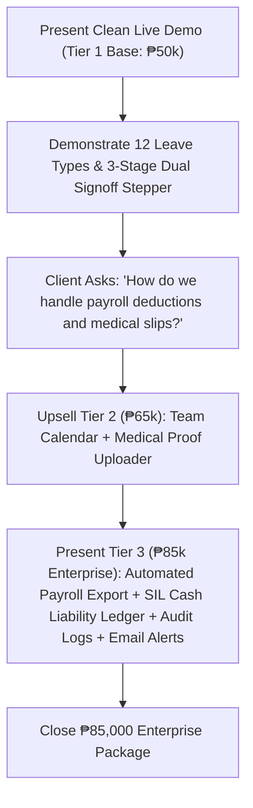

# Project Proposal & Pricing Tiers: Leave Management System (LMS)
**Client:** JTYeo CPA Accounting Office  
**Prepared For:** Atty. Jonathan Yeo, CPA & Management Committee  
**Currency:** Philippine Peso (PHP / ₱)

---

## Executive Summary
For a premier accounting and auditing firm in the Philippines, workforce scheduling, statutory compliance, and leave governance are critical to safeguarding client deliverables during peak tax and audit seasons. 

This proposal outlines three clear tiers designed to elevate **JTYeo CPA Accounting Office** from manual tracking to an enterprise-grade digital practice:
- **Tier 1 (₱50,000) — Core Leave Management Tracker (The Working Prototype)**
- **Tier 2 (₱65,000) — Professional CPA Practice Suite**
- **Tier 3 (₱85,000) — ⭐ Enterprise Practice Cloud Suite (Target Recommendation)**

---

## Feature Comparison Matrix

| Feature / Capability | Tier 1: Core (₱50,000) | Tier 2: Pro Suite (₱65,000) | Tier 3: Enterprise Suite (₱85,000) 🏆 |
| :--- | :---: | :---: | :---: |
| **Core Leave Tracking & Balances** | Included | Included | Included |
| **12 Philippine Statutory & CPA Categories** *(SIL, VL, SL, Bereavement, Emergency, Study, Solo Parent, Maternity/Paternity, Magna Carta, VAWC, LWOP)* | Included | Included | Included |
| **Role-Based Portals** *(Staff CPA, Senior Audit Lead, Managing Partner / HR)* | Included | Included | Included |
| **Dual Sign-off Approval Stepper** *(Staff &rarr; Lead Endorsement &rarr; Partner Final Signoff)* | Included | Included | Included |
| **Tax Season Peak Advisory Warnings** *(March 15 - April 15 ITR filing window)* | Included | Included | Included |
| **Interactive Team Absence Calendar & DOLE Holiday Engine** | — | Included | Included |
| **Medical Certificate & Document Proof Uploader / Viewer** | — | Included | Included (with Cloud Storage) |
| **Department Engagement Coverage & Overlap Detector** | — | Included | Included + Auto-Reallocation |
| **Administrative Credit Adjuster & Automated Accruals** *(+1.25d VL monthly, 5.0d SIL reset)* | — | Included | Included |
| **Year-End SIL Cash Monetization Ledger & Firm Liability Reserve Calculator** | — | — | **Included (DOLE Art. 95)** |
| **Automated Payroll Export (Formatted CSV for JuanTax / Sprout / QuickBooks)** | — | — | **Included** |
| **Immutable BIR-Ready Audit Trail & IP Activity Tracking** | — | — | **Included** |
| **Automated Real-Time Email Notifications & Manager Absence Alerts** | — | — | **Included** |
| **Extended Warranty & Priority SLA Support** | 30 Days | 60 Days | **3 Months Priority SLA + Staff Training** |

---

## Strategic Tier Breakdown

### 🥉 Tier 1: Core Leave Tracker — ₱50,000
* **Goal:** Eliminate paper forms, centralize balances, and enforce statutory leave compliance.
* **Includes:**
  1. Staff self-service portal with personal balance ledger (SIL, VL, SL, Solo Parent).
  2. 12 pre-configured Philippine statutory & CPA office leave categories.
  3. Working days calculator excluding weekends and Philippine holidays.
  4. 3-Stage visual approval workflow (Staff Filed &rarr; Lead Endorsement &rarr; Partner Approval).
  5. Peak BIR Tax Season (March 15 – April 15) advisory warnings.

---

### 🥈 Tier 2: Professional CPA Practice Suite — ₱65,000
* **Goal:** Enhance audit engagement coverage and verify medical compliance.
* **Includes everything in Tier 1 PLUS:**
  1. **Interactive FullCalendar Team Absence Schedule:** Visual monthly schedule of approved leaves and official Philippine holidays.
  2. **Medical Certificate & Document Proof Engine:** Staff upload doctor slips / CPD seminar notices with 1-click in-app preview for reviewers.
  3. **Engagement Coverage Conflict Detector:** Evaluates practice team availability before leaves are approved.
  4. **Administrative Leave Credit Adjuster:** Manual balance adjustments with internal remarks.

---

### 🥇 Tier 3: Enterprise Practice Cloud Suite — ₱85,000 ⭐ (Recommended)
* **Goal:** Complete digital integration connecting leave management directly to firm financials, payroll, and executive governance.
* **Includes everything in Tier 1 & 2 PLUS:**
  1. **Year-End SIL Cash Monetization & Liability Ledger (DOLE Art. 95):** Real-time automated calculation of unconsumed SIL credits $\times$ daily salary rate, forecasting total firm cash reserve obligations (e.g. ₱46,700.00).
  2. **Automated Payroll CSV Export Engine:** One-click payroll deduction summaries formatted for standard Philippine payroll computation (JuanTax, Sprout Solutions, QuickBooks, Excel).
  3. **Immutable Audit Activity Trail & IP Security Tracking:** Timestamped, tamper-proof logs capturing every application, approval, rejection, and balance change with client IP addresses.
  4. **Automated Real-Time Email Notifications:** Instant email notifications to staff and managers upon leave filing, lead endorsement, and partner decisions.
  5. **3 Months Priority SLA & Dedicated Partner Support:** Bug fixes, feature tweaks, and a live staff training walkthrough session.

---

## Pitch Strategy for Saturday's Presentation

### Executive Pitch Script:
> *"Atty. Yeo, what you are seeing today is the live Core Engine (₱50,000) which already solves 100% of the manual paperwork, tracking all 12 Philippine statutory leaves with peak tax season blackout warnings.*
> 
> *For an established practice like **JTYeo CPA Accounting Office**, we strongly recommend the **₱85,000 Enterprise Suite**. For just ₱85,000 total, you unlock the **Year-End SIL Cash Monetization Ledger** (giving you real-time visibility on cash reserves owed under DOLE Art. 95), **One-Click Formatted Payroll CSV Export**, **Immutable Audit Logs with IP tracking**, **Email Notifications**, and **3 Months Priority SLA Warranty** with complete staff training."*
