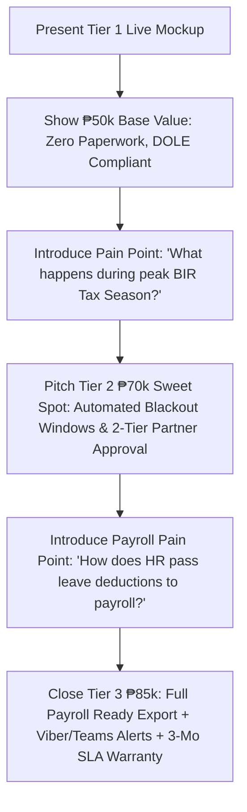

# Project Proposal & Pricing Tiers: Leave Management System (LMS)
**Client:** JTYeo CPA Accounting Office  
**Prepared For:** Executive Presentation & Proposal  
**Currency:** Philippine Peso (PHP / ₱)

---

## Executive Summary
For an accounting and auditing firm in the Philippines, workforce scheduling, billable hour tracking, and DOLE-compliant leave governance are critical to maintaining client deliverables during peak tax and audit seasons. 

This proposal outlines three strategic implementation tiers:
- **Tier 1 (₱50,000) — Core DOLE-Ready Leave Management System (Current Mockup Base)**
- **Tier 2 (₱70,000) — Advanced Accounting Workflow & Automated Notifications Tier (Recommended Sweet Spot)**
- **Tier 3 (₱85,000) — Enterprise Firm Edition (Payroll/Timesheet Integration & Multi-Branch Auditing)**

---

## Detailed Tier Comparison Matrix

| Feature / Capability | Tier 1: Core (₱50,000) | Tier 2: Pro Suite (₱70,000) ⭐ | Tier 3: Enterprise Suite (₱85,000) 🏆 |
| :--- | :---: | :---: | :---: |
| **Core Leave Tracking & Balances** | Included | Included | Included |
| **Philippine Statutory & CPA Practice Leaves** *(DOLE SIL, VL, SL, Bereavement, Emergency/Calamity, CPA Board Exam/CPD Study Leave, Solo Parent, Maternity/Paternity, Magna Carta, VAWC, LWOP)* | Included | Included | Included |
| **Role-Based Access** *(Staff Accountant, Team Lead, HR/Partner)* | Standard (2 Levels) | Multi-Level Hierarchical (3+ Levels) | Multi-Level + Partner Override & Multi-Department |
| **Philippine Holiday Calendar Integration** | Standard list | Dynamic DOLE/Proclamation Sync + Special Working/Non-Working rules | Dynamic DOLE + Custom Firm Year-End Closure Periods |
| **Leave Approval Engine** | Single-step (Lead/Admin) | 2-Step Approval (Supervisor -> Partner/HR) + Delegate Approver | Multi-stage dynamic routing with matrix approval |
| **Automated Email Notifications** | Basic confirmation | Full Email Templates (Apply, Approve, Reject, Reminder) | Instant Email + MS Teams / Viber / Slack Webhook Alerts |
| **Tax Season "Leave Freeze" Management** | Manual rejection | Automated Peak-Season "Blackout Period" Warnings & Quotas | Smart Quota Controls with partner exemption tokens |
| **Document / Medical Certificate Attachment** | Basic file upload | Secure Cloud Storage + preview & size optimization | Cloud storage + Medical certificate verification workflow |
| **Payroll & Timesheet Ready Exports** | Basic CSV export | Formatted Excel/CSV with Philippine Payroll coding | Direct API/CSV integration ready for Sprout, PayMongo, QuickBooks, or custom ERP |
| **Annual Leave Monetization / Conversion Calculator** | — | Included (DOLE SIL conversion computation) | Included + Taxable/Non-taxable monetization ledger |
| **Audit Trail & System Logs** | Standard timestamps | Detailed user activity logs (Who approved/modified and when) | Immutable BIR-ready audit logs with IP logging & report stamping |
| **Deployment, Hosting Setup & Training** | XAMPP/Cloud deploy + 1 training session | Cloud hosting setup + 2 training sessions + User manual PDF | Turnkey deployment + 3 training sessions + Video walkthroughs + 3 months priority SLA |

---

## Tier Breakdown & Sales Pitch Guide

### 🥉 Tier 1: Essential Leave Portal — ₱50,000 (Base Proposal)
*Target: Getting the firm organized, eliminating paper leave forms and spreadsheets.*

#### Scope of Deliverables:
1. **Interactive Web Dashboard**: Modern responsive UI accessible via desktop and mobile browser.
2. **Standard DOLE Statutory Leaves**: Configured for 5-day SIL, Vacation Leave, Sick Leave, Maternity/Paternity, and Solo Parent.
3. **Role Architecture**:
   - **Employee (Staff)**: Apply for leave, view personal balance, track status history.
   - **HR / Admin**: Review pending requests, approve/reject, adjust leave credits manually.
4. **Philippine Holiday Widget**: Tracks regular and special non-working days.
5. **Basic Reporting**: Summary data table with standard CSV download.
6. **Delivery Timeline**: 2–3 weeks.

---

### 🥈 Tier 2: Professional Accounting Practice Suite — ₱70,000 (Recommended Sweet Spot)
*Target: Designed specifically for CPA firms with seasonal workload pressure, project teams, and dual-signoff requirements.*

#### Why Upgrade from Tier 1 (+₱20,000 value):
1. **Two-Stage Approval Workflow**: Senior Auditor / Manager signs off on staff availability first, followed by HR/Managing Partner confirmation.
2. **Automated Email Notifications**: Real-time email alerts with 1-click quick-approve links for busy partners on the go.
3. **Tax Season Leave Freeze (Blackout Dates)**: Configure custom lockout windows (e.g., March 15 to April 15 BIR filing peak) where leaves trigger managerial review warnings.
4. **DOLE SIL Monetization & Carry-Over Engine**: Automatically computes unused leave cash conversions at year-end in compliance with Philippine labor standards.
5. **Medical Certificate & Document Uploader**: Employees can attach sick leave doctor slips with secure in-app preview for HR.
6. **Detailed Audit Trail**: Track timestamped records of every approval, adjustment, and cancellation for compliance transparency.
7. **Delivery Timeline**: 3–4 weeks.

---

### 🥇 Tier 3: Enterprise Accounting Suite & Payroll Sync — ₱85,000 (Maximum Value)
*Target: Full-scale digital transformation with payroll readiness, chat alerts, and premium executive governance.*

#### Why Upgrade from Tier 2 (+₱15,000 incremental value):
1. **Payroll Export Engine**: One-click payroll export mapped to client's payroll software or Excel format (computes unpaid leaves, deductions, and taxable vs non-taxable conversions).
2. **Multi-Department / Engagement Team Matrix**: Group staff by Audit, Tax, Advisory, Bookkeeping, and Admin with department-specific leave caps (so no engagement team is left understaffed).
3. **Chatbot / Messaging Alerts (Viber / MS Teams / Slack)**: Instant ping to managers when emergency sick leave is submitted in the morning.
4. **Partner Analytics & Executive BI Dashboard**:
   - Monthly absentee heatmaps.
   - Utilization rate during audit seasons.
   - Departmental leave liability forecasting (monetary cost of unconsumed leaves).
5. **Priority Warranty & SLA Support**: 3 months complimentary bug fixes, priority feature tweaks, video staff training library, and on-demand partner support.
6. **Delivery Timeline**: 4–5 weeks.

---

## Strategy for Saturday's Pitch

### Closing Pitch Script for the Meeting:
> *"We have already built the core Tier 1 engine (₱50k) that eliminates paper forms and manages DOLE statutory leaves. However, because you are an accounting firm handling critical audit and tax deadlines, we strongly recommend **Tier 2 (₱70k Sweet Spot)** or **Tier 3 (₱85k Enterprise)**. For just an additional ₱20k–₱35k, you get peak-season leave lockdown controls, automated 2-tier partner signoffs via email, instant Viber morning absence alerts, and direct payroll-ready leave deduction exports with 3 months full SLA warranty."*
