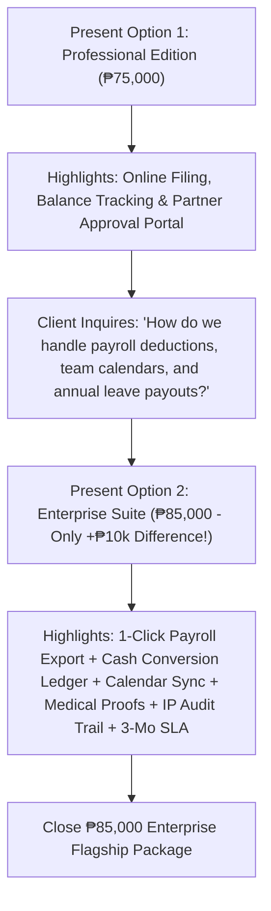

# Project Implementation Proposal & Package Options
**Client:** JTYeo CPA Accounting Office  
**Prepared For:** Atty. Jonathan Yeo, CPA & Management Committee  
**Currency:** Philippine Peso (PHP / ₱)

---

## Executive Summary
For an established accounting and auditing practice, workforce availability, leave management, and engagement governance are vital to maintaining client service quality and meeting critical firm deadlines.

This proposal presents **two complete implementation package options** tailored for **JTYeo CPA Accounting Office**:
- **Option 1: Professional Edition (₱75,000)** — Complete standalone leave management portal.
- **Option 2: Enterprise Cloud Suite (₱85,000) 🏆** — Fully automated ecosystem with payroll sync, financial liability forecasting, team calendars, and medical document verification.

---

## 📊 Side-by-Side Deliverables Comparison

| System Capability | Option 1: Professional Edition (₱75,000) | Option 2: Enterprise Cloud Suite (₱85,000) 🏆 |
| :--- | :--- | :--- |
| **Leave Categories & Policies** | 5 Core Categories (VL, SL, Emergency, Bereavement, LWOP) | Full 12 Statutory & Firm Categories (Solo Parent, Maternity, Paternity, Special Women, VAWC, Study, etc.) |
| **Payroll Processing** | Standard Table View & Manual Entry | Automated 1-Click Formatted Payroll CSV Export (JuanTax, Sprout Solutions, QuickBooks, Excel) |
| **Annual Financial Liabilities** | Manual Computation at Year-End | Automated Year-End Unused Leave Cash Conversion Ledger & Reserve Liability Forecast |
| **Workforce Scheduling** | Standard List View by Department | Interactive Multi-Department Absence Calendar with Real-Time Availability Sync |
| **Medical Proof Verification** | Manual Physical Copy Verification | In-App Medical Certificate & Document Proof Uploader & 1-Click Viewer |
| **Compliance & Audit Trails** | Standard Transaction Records | Immutable Enterprise Audit Trail with IP Tracking, User Identification, and Timestamps |
| **System Notifications** | In-App Dashboard Notifications | Automated Real-Time Transactional Email Alerts for Submissions, Approvals, and Rejections |
| **Calendar & Working Days** | Standard Consecutive Calendar Days | Automated Intelligence Engine (Auto-Excludes Weekends & Official Regular/Special Holidays) |
| **Peak Tax Season Governance** | Standard Partner Review | Automated Peak Tax Season Blackout Warning & Engagement Clearance Advisory Engine |
| **Credit Accrual & Rollover** | Manual Periodic Adjustments | Automated Monthly Accruals (+1.25d/mo) & Annual Fiscal Year Rollover Engine |
| **Employee Self-Service** | Personal Balance Tracking (VL, SL, Active Balance) | Full Self-Service Suite with Real-Time Balance Ledgers & Entitlement Rules |
| **Management Governance** | Partner Approval Queue & On-Behalf Filing | Executive Portal with Approvals, Analytics, Multi-Staff Filing & Audit Logs |
| **Warranty & SLA Support** | 60 Days Standard Maintenance Support | 3 Months Priority SLA Support + Live Staff Onboarding & Training Session |

---

## 🥈 Option 1: Professional Edition — ₱75,000
> **Summary:** A streamlined, reliable digital leave management system designed to eliminate physical paper forms and centralize leave approvals.

### 📦 Deliverables & Specifications:
1. **Employee Self-Service Portal:**
   - Dedicated portal for associates to check remaining balances (Vacation Leave, Sick Leave, Total Available Balance).
   - Online leave application filing with real-time balance checks.
   - Complete personal leave history with real-time status tracking (*Approved, Pending, Rejected*).
2. **5 Core Leave Categories:**
   - 🌴 Vacation Leave (VL)
   - 🏥 Sick Leave (SL)
   - 🚨 Emergency Leave
   - 🕊️ Bereavement Leave
   - 💼 Leave Without Pay (LWOP)
3. **Managing Partner Executive Dashboard:**
   - Centralized overview of pending requests, active leaves, and firm headcount.
   - Master Firm Leave Ledger displaying all employee submissions.
4. **1-Click Review & Decision Queue:**
   - Quick approval and rejection actions with customized feedback and engagement coverage notes.
5. **Managing Partner On-Behalf Filing:**
   - Ability for the Managing Partner to submit leave applications on behalf of any associate.
6. **Application Details Breakdown:**
   - Clean summary modal of employee name, leave type, inclusive dates, duration, reason, and Partner review status.
7. **Warranty & Technical Support:**
   - 60 Days standard bug-fix warranty and system maintenance.

---

## 🥇 Option 2: Enterprise Cloud Suite — ₱85,000 ⭐ *(Recommended)*
> **Summary:** A comprehensive, fully automated practice management suite connecting leave governance directly to firm financials, payroll, team schedules, and compliance audits.

### 📦 Deliverables & Specifications (Everything in Option 1 PLUS):
1. **📊 Automated Payroll CSV Export Engine:**
   - One-click export custom-formatted for Philippine payroll software (**JuanTax**, **Sprout Solutions**, **QuickBooks**, or Excel). Automatically computes unpaid leave deductions per pay period.
2. **💰 Year-End Unused Leave Cash Conversion Ledger & Reserve Calculator:**
   - Real-time automated computation multiplying unconsumed leave credits by employee daily wage rates, providing Managing Partners with an instant calculation of annual cash obligations.
3. **📅 Interactive Multi-Department Absence Calendar:**
   - Visual monthly calendar showing planned absences across taxation, audit, and advisory teams to avoid understaffing during critical client engagements.
4. **📎 Medical Certificate & Document Proof Viewer:**
   - Staff can upload physician notes, medical certificates, and official slips with 1-click in-app viewing for Partner verification.
5. **🛡️ Immutable Enterprise Audit Trail with IP Tracking:**
   - Tamper-proof logs capturing every submission, approval, rejection, and balance change with exact timestamps, user names, and client IP addresses.
6. **📧 Automated Real-Time Email Notifications:**
   - Instant transactional email alerts sent to staff and partners whenever leave applications are filed, approved, or decided.
7. **🌴 Automated Holiday & Working Days Exclusion Calculator:**
   - Automatically calculates working days by excluding weekends and official statutory regular and special non-working holidays.
8. **⚠️ Peak Tax Season Blackout Advisory Engine:**
   - Visual alert banner and partner clearance enforcement for leaves filed during peak annual income tax return deadlines.
9. **⚙️ Administrative Accrual Engine:**
   - Automated monthly accrual rules (+1.25d VL monthly) and annual fiscal year rollover configuration.
10. **📜 Extended Statutory Category Pack:**
    - Full configuration of Solo Parent Leave, Maternity Leave, Paternity Leave, Special Women Leave, VAWC Leave, and CPA Board Exam/CPD Study Leave.
11. **🤝 Priority Warranty & SLA Support:**
    - **3 Months Priority SLA Support**, video tutorials, and a live executive onboarding training session for all practice staff.

---

## 🎯 Executive Pitch Strategy for Atty. Jonathan Yeo

> *"Atty. Yeo, our **Professional Edition (₱75,000)** provides a clean digital system to replace paper forms and centralize approvals.*
> 
> *However, for just an additional **₱10,000 (₱85,000 Enterprise Suite)**, your firm receives **1-Click Formatted Payroll CSV Export**, the **Year-End Unused Leave Cash Conversion Ledger** (calculating annual cash liabilities), **Interactive Team Absence Calendars**, **Medical Document Verification**, **Immutable Audit Logs with IP tracking**, **Email Notifications**, and **3 Months Priority SLA Warranty** with full staff training."*
