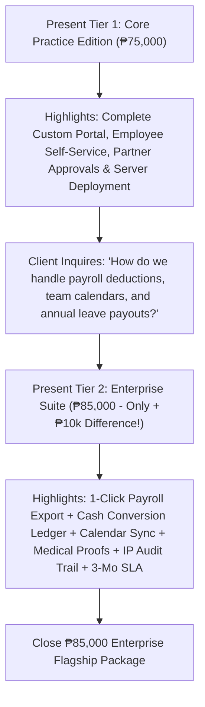

# Software Development Proposal & Pricing Packages
**Client:** JTYeo CPA Accounting Office  
**Prepared For:** Atty. Jonathan Yeo, CPA & Management Committee  
**Currency:** Philippine Peso (PHP / ₱)

---

## Executive Summary
For an established accounting and auditing practice, workforce availability, leave management, and engagement governance are vital to maintaining client service quality and meeting critical firm deadlines.

This proposal outlines **two comprehensive software delivery packages** custom-developed and deployed for **JTYeo CPA Accounting Office**:
- **Tier 1: Core Practice Management Edition (₱75,000)** — Standalone practice leave management software and deployment.
- **Tier 2: Enterprise Practice Cloud Suite (₱85,000) 🏆** — Complete automated ecosystem integrating payroll sync, financial liability forecasting, team calendars, and compliance audit trails.

---

## 📊 Comprehensive Deliverables Matrix

| System Module & Deliverable | Tier 1: Core Practice Edition (₱75,000) | Tier 2: Enterprise Cloud Suite (₱85,000) 🏆 |
| :--- | :--- | :--- |
| **System Scope & Purpose** | Standard Practice Leave Management Software | Full-Scale Automated Practice & Compliance Suite |
| **Leave Policy Coverage** | 5 Core Firm Categories (VL, SL, Emergency, Bereavement, LWOP) | Full 12 Statutory & Firm Categories (Solo Parent, Maternity, Paternity, Special Women, VAWC, Study, etc.) |
| **Payroll Software Integration** | Standard Table View & Manual Entry | 1-Click Formatted Payroll CSV Export (JuanTax, Sprout Solutions, QuickBooks, Excel) with Auto-Deductions |
| **Year-End Financial Reserves** | Manual Computation by Accounting Staff | Automated Real-Time Leave Cash Conversion Ledger & Annual Liability Reserve Calculator |
| **Team Workforce Scheduling** | Standard List Ledger by Department | Interactive Multi-Department Absence Calendar with Visual Availability & Audit Schedule Sync |
| **Document Proof Verification** | Physical Paper Document Submission | In-App Medical Certificate & Document Proof Uploader & 1-Click Secure In-App Viewer |
| **Compliance & Security Logs** | Standard Application Database Records | Immutable Enterprise Audit Trail with IP Tracking, User Identification, and Timestamps |
| **Automated Alerts** | In-App Dashboard Notifications | Real-Time Automated Transactional Email Alerts for Submissions, Approvals, and Rejections |
| **Working Days Calculation** | Consecutive Calendar Days Math | Automated Working Days Engine (Auto-Excludes Weekends & Official Regular/Special Holidays) |
| **Tax Season Governance** | Standard Partner Review | Peak Tax Season Blackout Advisory Engine with Client Engagement Clearance Alerts |
| **Accrual & Rollover Engine** | Manual Periodic Balance Adjustments | Automated Monthly Accruals (+1.25d/mo) & Annual Fiscal Year Rollover Engine |
| **User Access Control (RBAC)** | Role-Based Access (Staff, Senior, Partner/HR) | Advanced Multi-Level Governance & Delegated Approvals |
| **Production Deployment** | Full Server Setup, Database Config & SSL | Full Server Setup, Database Config, SSL & Scheduled Auto-Backups |
| **Warranty & SLA Support** | 60 Days Standard Maintenance Support | 3 Months Priority SLA Support + Live Staff Onboarding & Training Session |

---

## 🥈 Tier 1: Core Practice Management Edition — ₱75,000
> **Package Scope:** A custom-built, dedicated practice leave management platform developed and deployed directly on firm servers to digitize leave operations and streamline approvals.

### 📦 Key Features & Deliverables:
1. **Role-Based Access Control (RBAC) & Security:**
   - Multi-role secure architecture with individual login credentials for Staff Associates, Senior Auditors, HR, and Managing Partners.
2. **Real-Time Leave Balance & Entitlement Engine:**
   - Dynamic tracking of employee annual leave entitlements (Vacation Leave, Sick Leave, Emergency Leave, Bereavement Leave, and Leave Without Pay).
   - Real-time balance deductions upon Partner approval.
3. **Structured Approval Workflow & Partner Governance:**
   - Executive approval portal allowing Managing Partners to review, approve, or reject requests with customized feedback notes.
4. **Partner Proxy & Executive Leave Filing:**
   - Capability for Managing Partners and HR to file and adjust leaves directly on behalf of any team member.
5. **Employee Self-Service Portal:**
   - Intuitive dashboard for associates to check available leave balances, submit requests, and track approval status in real-time.
6. **Master Firm Leave Ledger:**
   - Filterable firm-wide ledger with search capabilities and historical record tracking.
7. **Production Server Deployment & Setup:**
   - Complete production deployment, database schema setup, and SSL security configuration on firm infrastructure.
8. **Warranty & Technical Support:**
   - 60 Days standard bug-fix warranty and technical maintenance.

---

## 🥇 Tier 2: Enterprise Practice Cloud Suite — ₱85,000 ⭐ *(Recommended)*
> **Package Scope:** The complete flagship automation ecosystem designed specifically for accounting practices, eliminating administrative friction between leave tracking, payroll computation, financial liability planning, and client engagement scheduling.

### 📦 Key Features & Deliverables (Everything in Tier 1 PLUS):
1. **📊 Automated Formatted Payroll CSV Export Engine:**
   - One-click export custom-tailored for Philippine payroll software (**JuanTax**, **Sprout Solutions**, **QuickBooks**, or Excel). Automatically calculates unpaid leave salary deductions per pay cut-off.
2. **💰 Year-End Unused Leave Cash Conversion Ledger & Reserve Calculator:**
   - Real-time automated calculator that multiplies unconsumed leave credits by employee daily wage rates, providing Managing Partners with an instant calculation of annual cash liability reserves for financial planning.
3. **📅 Interactive Multi-Department Absence Calendar:**
   - Visual monthly schedule showing planned absences across Taxation, Audit, and Advisory groups to eliminate understaffing during critical client engagements and audit cut-offs.
4. **📎 Digital Medical Certificate & Supporting Proof Engine:**
   - Staff can upload physician notes, medical certificates, CPD seminar slips, and official documents with 1-click in-app viewing for Partner verification.
5. **🛡️ Immutable Enterprise Audit Trail & IP Security Tracking:**
   - Tamper-proof activity logs capturing every leave filing, approval, rejection, and balance modification with exact timestamps, user names, and client IP addresses.
6. **📧 Automated Real-Time Email Notifications:**
   - Instant transactional email alerts sent to staff and partners whenever leave applications are filed, approved, or decided.
7. **🌴 Automated Holiday & Working Days Exclusion Calculator:**
   - Automated calendar intelligence that detects and excludes weekends and official statutory regular/special non-working holidays from leave deductions.
8. **⚠️ Peak Tax Season Blackout Advisory Engine:**
   - Visual advisory alert banner and partner clearance enforcement for leaves requested during annual income tax return filing periods.
9. **⚙️ Automated Monthly Accrual & Annual Fiscal Rollover Engine:**
   - Configurable monthly accrual rules (+1.25d VL monthly) and automated year-end credit resets and rollovers.
10. **📜 Extended Statutory Category Pack:**
    - Full configuration of Solo Parent Leave, Maternity Leave, Paternity Leave, Special Women Leave, VAWC Leave, and CPA Board Exam/CPD Study Leave.
11. **🤝 3 Months Priority SLA Support & Executive Staff Onboarding:**
    - **3 Months Extended Priority SLA Support**, video walkthroughs, and a live executive onboarding training session for all practice staff.

---

## 🎯 Executive Presentation Pitch for Atty. Jonathan Yeo

> *"Atty. Yeo, our **Core Practice Edition (₱75,000)** delivers a full-scale digital leave management system custom-deployed on your firm's infrastructure, centralizing staff filings and partner approvals.*
> 
> *However, for just an additional **₱10,000 (₱85,000 Enterprise Suite)**, your firm gains **1-Click Formatted Payroll CSV Export**, the **Year-End Unused Leave Cash Conversion Ledger** (calculating annual cash liabilities), **Interactive Team Calendars**, **Medical Document Verification**, **Immutable Audit Logs with IP tracking**, **Email Notifications**, and **3 Months Priority SLA Warranty** with comprehensive staff training."*
